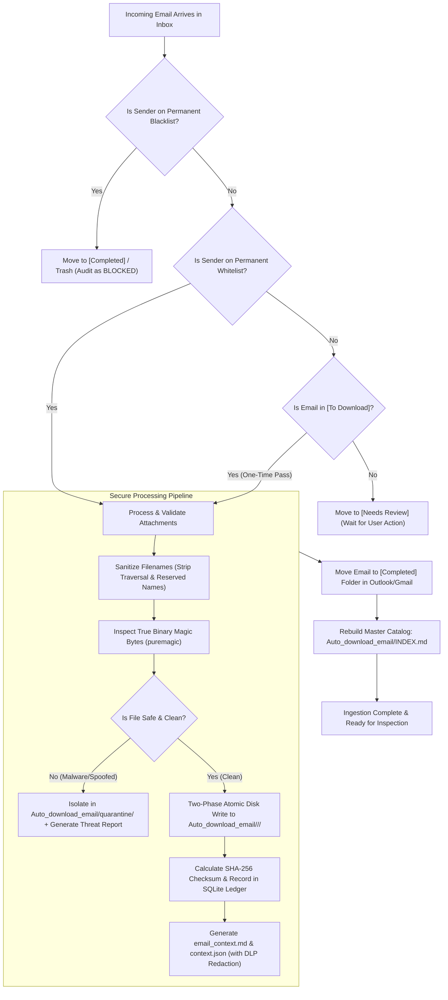

# Enterprise Email Ingestion Gateway
## Architecture & Design Decision Report: "Folder Remote Control" Automation

---

## 1. Executive Summary

This report establishes the architectural blueprint and operational workflow for the **Zero-UI "Folder Remote Control"** approach in the Enterprise Email Ingestion System.

### The Core Design Philosophy: "Zero-Software, Zero-Friction"
Most business automation systems fail or meet user resistance because they force non-technical staff (finance, legal, administrative, and operations personnel) to adopt new software, interact with command terminals, open separate web dashboards, or remember logins.

The **Folder Remote Control** design leverages the interface employees already use and trust every day: **Microsoft Outlook and Google Workspace (Gmail)**. By assigning deterministic business logic to a small set of email folders/labels, users control the entire ingestion, approval, and whitelisting lifecycle simply by dragging and dropping emails.

---

## 2. Folder Architecture & Semantics

The email account (or shared corporate mailbox) is structured with five dedicated automation folders:

```
📥 Mailbox Root
 ├── 📁 [To Download]        <-- ONE-TIME PASS: Download attachments once (No whitelisting)
 ├── 📁 [Approved Senders]   <-- PERMANENT WHITELIST: Download now & allow all future emails
 ├── 📁 [Blocked Senders]    <-- PERMANENT BLACKLIST: Block sender forever & purge from intake
 ├── 📁 [Needs Review]       <-- HOLDING QUEUE: New / unverified senders wait here
 └── 📁 [Completed]          <-- ARCHIVE / AUDIT: Automatically moved here after processing
```

### Folder Operational Rules

| Folder Name | Purpose | Action on Sender | Action on Attachments | Next Destination |
| :--- | :--- | :--- | :--- | :--- |
| **`[To Download]`** | **One-Time Pass** | **No change to whitelist.** Sender remains unprivileged. | Downloads all valid attachments for this specific email only. | Moved to `[Completed]` |
| **`[Approved Senders]`** | **Permanent Whitelist** | Sender address (`user@corp.com`) or domain is permanently added to the system allowlist. | Downloads attachments and ensures all future incoming emails from this sender process automatically. | Moved to `[Completed]` |
| **`[Blocked Senders]`** | **Permanent Blacklist** | Sender address or domain is permanently added to `excluded_senders.txt`. | Discarded/skipped; no attachments are downloaded. | Moved to `[Completed]` or Deleted |
| **`[Needs Review]`** | **Safety Holding Area** | Unknown senders who are not yet on the allowlist or blocklist. | Held in isolation; attachments are staged but not released to the master index. | Waits for user to drag to `[Approved]`, `[To Download]`, or `[Blocked]` |
| **`[Completed]`** | **Audit Archive** | None. | Already safely stored and indexed in `Auto_download_email/`. | Stays archived for compliance records |

---

## 3. Orderly Step-by-Step Email Lifecycle

The following diagram and sequential breakdown illustrate what happens from the moment an email arrives until its files are safely cataloged on disk.



### Detailed Sequential Execution Steps

#### Step 1: Ingestion & Inbox Inspection
* The Python service wakes up (via scheduled interval or real-time event).
* It queries the mailbox for new items.
* It checks both the primary inbox and any manual user actions in `[To Download]`, `[Approved Senders]`, and `[Blocked Senders]`.

#### Step 2: Policy & Permission Evaluation
* **Case A (In `[Blocked Senders]`):** The system updates the local database and `excluded_senders.txt`, records an audit event, and moves the email to `[Completed]`.
* **Case B (In `[Approved Senders]`):** The system permanently records the sender address into the approved database table. Future emails from this sender will never require manual intervention.
* **Case C (In `[To Download]` - One-Time Pass):** The system processes the email's attachments **without modifying the sender whitelist**. If this sender emails again next week, their next email will still go to `[Needs Review]` unless explicitly whitelisted later.
* **Case D (In Inbox from Unknown Sender):** If an unapproved sender arrives in the main inbox, the automation cleanly moves it to `[Needs Review]`, ensuring no unauthorized files enter the system uninspected.

#### Step 3: Defensive Attachment Extraction & Validation
* Filenames are sanitized through `pathvalidate` (removing `../`, control characters, and Windows reserved names like `CON`, `NUL`).
* Magic bytes are sniffed using `puremagic` to verify that a file claiming to be a `.pdf` is genuinely a PDF and not an executable `.exe` or script.
* Inline logos and small email signature badges (<15 KB) are identified and ignored.
* If a file fails security verification, it is locked into `Auto_download_email/quarantine/` with a companion `.report.md` threat alert.

#### Step 4: Atomic Persistence & Context Sidecars
* Safe attachments are streamed to a hidden staging folder (`.staging/`) and flushed to disk (`os.fsync`) before being atomically renamed into their final directory:
  `Auto_download_email/<sanitized_sender>/<timestamp>_<hash_prefix>/`
* Alongside the attachments, a human-readable summary (`email_context.md`) and a machine-readable record (`context.json`) are written, capturing the sender's original message, subject, date, and thread ID. Sensitive data (credit cards, passwords) is automatically redacted by DLP filters.

#### Step 5: Mailbox Cleanup & Catalog Regeneration
* Inside Outlook or Gmail, the email is moved from `[To Download]` or `[Approved Senders]` into **`[Completed]`**. This keeps the employee's folders clean and provides immediate visual confirmation that the automation finished.
* The master catalog **`Auto_download_email/INDEX.md`** is updated atomically, giving managers and staff a clickable table to view and open all newly downloaded files.

---

## 4. Architectural Decision Analysis: Why This Approach vs. Alternatives

To ensure this project meets enterprise standards, four distinct architectural interfaces were evaluated.

```
┌────────────────────────────────────────────────────────────────────────┐
│                        COMPARATIVE ARCHITECTURE                        │
├──────────────────────┬────────────────────────┬────────────────────────┤
│ Option               │ Selected?              │ Primary Rationale       │
├──────────────────────┼────────────────────────┼────────────────────────┤
│ 1. Folder Remote     │ ✅ APPROVED             │ 100% Zero-UI, zero     │
│    Control           │                        │ friction for employees │
├──────────────────────┼────────────────────────┼────────────────────────┤
│ 2. Terminal Checkbox │ ❌ REJECTED             │ Intimidating and       │
│    (TUI)             │                        │ impractical for staff  │
├──────────────────────┼────────────────────────┼────────────────────────┤
│ 3. Web Browser       │ ❌ REJECTED             │ High security surface, │
│    Dashboard         │                        │ extra server to host   │
├──────────────────────┼────────────────────────┼────────────────────────┤
│ 4. Desktop Window    │ ❌ REJECTED             │ OS compatibility bugs, │
│    (Tkinter/Qt)      │                        │ desktop app clutter    │
└──────────────────────┴────────────────────────┴────────────────────────┘
```

### Deep-Dive Analysis of Alternatives

#### Option 1: Folder Remote Control (Selected & Approved)
* **Why it was chosen:**
  1. **Zero New Software:** Every employee in the company already has Outlook or Gmail open on their screen all day. They do not need to install anything new.
  2. **Works Everywhere (Mobile, Web, Desktop):** An executive on an iPhone or an employee on a Windows laptop can drag an email into `[To Download]` while on the train, and the backend automation processes it immediately.
  3. **Zero Security Attack Surface:** There are no open web ports (`HTTP 8000`), no web login pages to get hacked, no session cookies, and no network firewall configurations required.
  4. **Native Corporate Audit Trail:** Microsoft Exchange and Google Workspace natively log all folder moves, providing an immutable enterprise audit trail.

---

#### Option 2: Terminal / Command-Line Checkbox Interface (Rejected)
* **Why it was rejected:**
  1. **Unusable by Non-Engineers:** Office managers, accountants, and legal staff should never be asked to open a Linux bash shell, navigate directories, or run Python scripts.
  2. **Access Restrictions:** Giving regular staff SSH or terminal access to the production server violates corporate security policies.
  3. **Error Prone:** Accidental keystrokes in terminal environments can terminate background services.

---

#### Option 3: Local Web Dashboard / Browser Interface (Rejected)
* **Why it was rejected:**
  1. **Security Vulnerabilities:** Running a web server (FastAPI, Flask, or Django) creates new security risks inside the company network: Cross-Site Scripting (XSS), Cross-Site Request Forgery (CSRF), and unauthorized local port sniffing.
  2. **Authentication Overhead:** A web dashboard requires user management, password storage, and session timeouts to prevent unauthorized employees on the same network from viewing sensitive invoices.
  3. **Behavioral Friction:** Employees forget bookmarks, let browser sessions expire, and find switching between Outlook and a browser tab annoying.

---

#### Option 4: Dedicated Desktop App Window (Rejected)
* **Why it was rejected:**
  1. **Cross-Platform Headaches:** Desktop GUI frameworks (Tkinter, PyQt, PySide) often experience display scaling issues, font rendering bugs, and permission conflicts across different versions of Windows, macOS, and Linux.
  2. **Headless Server Incompatibility:** The automation service is designed to run in the background on a server or container (Docker/systemd). A desktop GUI requires an active graphical display (X11 / Wayland), preventing headless cloud deployment.
  3. **Installation & Update Burden:** IT departments must package, sign, distribute, and update desktop client software on every employee's workstation.

---

## 5. Comprehensive Comparison Matrix

| Evaluation Criterion | 1. Folder Remote Control (Chosen) | 2. Terminal TUI (Rejected) | 3. Web Dashboard (Rejected) | 4. Desktop Window (Rejected) |
| :--- | :--- | :--- | :--- | :--- |
| **Target User** | Any Office Employee | Developers / Sysadmins | Office Staff | Desktop Power Users |
| **Learning Curve** | **Zero (Already know Outlook)** | Steep (Command-line) | Low (Web page) | Low (Desktop app) |
| **Mobile Accessibility** | **Yes (via Outlook / Gmail app)** | No | Limited | No |
| **Security Surface** | **Zero extra attack surface** | Server Shell Access | Web Ports, XSS, CSRF | Local process execution |
| **Headless Server Deploy** | **Native (Runs in Docker/daemon)**| Server only | Requires web daemon | Fails (Needs graphical display) |
| **Maintenance Cost** | **Extremely Low** | Low | High (Web framework) | High (OS packaging) |
| **"One-Time Pass" Support**| **Yes (Drag to `[To Download]`)** | Awkward flag passing | Requires custom button | Checkbox toggle |

---

## 6. Implementation Specifications for the Codebase

To incorporate this approved workflow into the existing repository (`email-attachment-downloader`), the following modular updates are scheduled:

1. **Connector Extension (`src/email_ingestion/connectors/`):**
   * Add folder resolution and message-moving methods (`move_message(message_id, target_folder)`):
     * **IMAP:** `client.move(msg_id, folder_name)`
     * **Gmail API:** `service.users().messages().modify(userId='me', id=msg_id, body={'addLabelIds': [...], 'removeLabelIds': [...]})`
     * **Microsoft Graph:** `client.users.by_user_id(uid).messages.by_message_id(mid).move.post(...)`
2. **Folder State Manager (`src/email_ingestion/engine.py`):**
   * **Rule 1 (`[To Download]`):** Download attachments once $\rightarrow$ Do NOT write to `excluded_senders.txt` or approved tables $\rightarrow$ Move to `[Completed]`.
   * **Rule 2 (`[Approved Senders]`):** Record sender address to persistent approved database $\rightarrow$ Download attachments $\rightarrow$ Move to `[Completed]`.
   * **Rule 3 (`[Blocked Senders]`):** Record sender to `excluded_senders.txt` $\rightarrow$ Skip attachments $\rightarrow$ Move to `[Completed]`.
   * **Rule 4 (Unknown in Inbox):** Move email to `[Needs Review]` until employee decides.
3. **Configuration Defaults (`config.yaml`):**
   * Introduce a declarative `folder_control` block:
     ```yaml
     folder_control:
       enabled: true
       to_download_folder: "[To Download]"
       approved_folder: "[Approved Senders]"
       blocked_folder: "[Blocked Senders]"
       review_folder: "[Needs Review]"
       completed_folder: "[Completed]"
     ```
