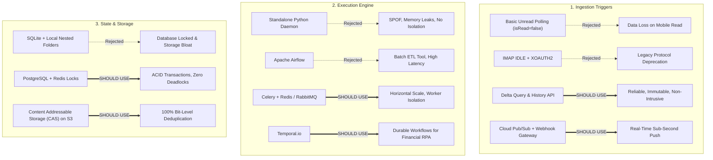
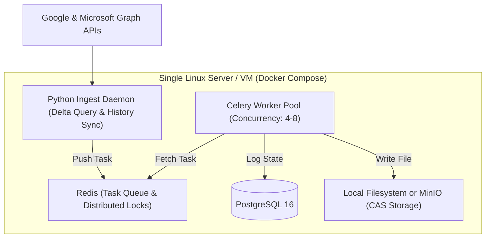
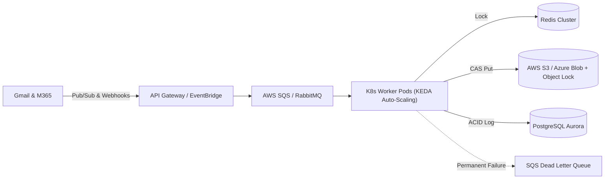

# Enterprise Email Ingestion: Critical Vulnerability Analysis & Industrial Architecture Benchmark

---

## Executive Overview

This report provides a rigorous technical critique and industrial benchmark for the **Enterprise Python Email Attachment Ingestion Engine**. 

Following extensive research and red-teaming across Google Workspace and Microsoft 365 ecosystems, we identified **seven major architectural traps** in the initial design. We then evaluated each against modern enterprise standards used in RPA, financial data ingestion, and cloud-native automation.

---

## Part 1: Critical Flaws & Vulnerabilities in the Initial Design

```
+----------------------------------------------------------------------------------------------------+
|                                    CRITICAL TRAPS IDENTIFIED                                       |
+------------------------------+----------------------------------+----------------------------------+
| 1. The 'Unread' Query Trap   | 2. Partial Download Disasters    | 3. Zero-Attachment Black Hole    |
| Human reads email on phone   | Network drops on 2nd attachment; | Plain-text email marked read;    |
| -> Email permanently lost!   | 3rd is never downloaded.         | urgent client notices missed!    |
+------------------------------+----------------------------------+----------------------------------+
| 4. Signature & Logo Clutter  | 5. NAT / Firewall Wall           | 6. MS Graph 4MB Timeout Trap     |
| Company banners, social icons| Push Webhooks cannot reach       | $expand fails on files > 4MB;    |
| clutter disk folders.        | local machines behind routers.   | Base64 exhausts server memory.   |
+------------------------------+----------------------------------+----------------------------------+
| 7. The 7-Day OAuth Cliff     | 8. Display Name & Path Exploits  | 9. Trusted Sender ATO Risk       |
| Tokens die after 168 hours;  | Filenames with ../ or PRN/CON;   | Compromised vendor account sends |
| daemon crashes silently.     | folder timestamp collisions.     | macro weaponized spreadsheets.   |
+------------------------------+----------------------------------+----------------------------------+
```

### 1.1 The "Mark as Read" & "Unread Query" Trap (Data Loss)
* **The Vulnerability:** Querying `isRead eq false` or `is:unread` assumes the Python script is the only entity interacting with the mailbox.
* **The Reality:** Users open emails on their mobile phones (iOS Mail, Gmail, Outlook app) or leave the desktop preview pane on for 3 seconds. The mail client automatically marks the email as **Read**.
* **The Impact:** When the Python script runs, the email is already read. **The system silently ignores it, and the attachment is permanently lost.**
* **The Fix:** Never use read/unread status as a processing flag. Treat mailboxes as read-only observers or apply a dedicated system label/category (e.g., `Label: AutoDownloaded`), while keeping an immutable log of processed Message IDs in a state database.

### 1.2 Partial Network Failures & Atomic Writes
* **The Vulnerability:** If an email has 3 attachments and the connection drops while downloading the second:
  * If the script marks read *before* downloading: Attachments #2 and #3 are permanently lost.
  * If the script marks read *after* downloading: The script crashes before marking read; on restart, it re-downloads Attachment #1, creating corrupted or duplicate files.
* **The Fix:** Two-phase atomic write pipeline:
  1. Stream download to a temporary staging file (`attachment.pdf.tmp`).
  2. Compute SHA-256 hash and verify non-zero size.
  3. Atomically rename via `os.replace()` to the destination path.
  4. Commit attachment state in the database before acknowledging the message.

### 1.3 Zero-Attachment Plain-Text Emails
* **The Vulnerability:** A trusted client sends an urgent text-only email: *"Urgent: do not process the invoice sent earlier, wire details changed."*
* **The Impact:** If the script queries all emails from trusted senders and marks them read after finding no attachments, the human user never sees an unread notification on their phone/desktop.
* **The Fix:** Query specifically for messages with attachments (`hasAttachments eq true` / `has:attachment`), and **never mark emails as read**.

### 1.4 Signature Clutter & Inline Media Bloat
* **The Vulnerability:** Corporate emails contain embedded logos, social media banners, and tracking pixels (`image001.png`, `logo.jpg`).
* **The Reality:** If raw attachments are downloaded blindly, the folder hierarchy becomes clogged with thousands of useless 5KB icon files.
* **The Fix:** Multi-tier MIME filtering:
  * Check `Content-Disposition == "inline"` and presence of `Content-ID` (CID) referenced in the HTML body.
  * Filter out images smaller than 20KB or with square icon aspect ratios unless explicitly whitelisted.

### 1.5 The Webhook Ingress Problem Behind NAT / Firewalls
* **The Vulnerability:** Push webhooks (Graph Subscriptions, Gmail Push) require a publicly reachable HTTPS server with a valid TLS certificate and an open inbound port.
* **The Reality:** Local developer laptops, office desktops, and internal company servers sit behind NAT routers and firewalls. Inbound webhooks cannot reach them without insecure reverse tunnels (e.g., ngrok) which violate enterprise security policies.
* **The Fix:**
  * **For Gmail:** Google Cloud Pub/Sub **Streaming Pull**. Initiates an outbound persistent gRPC connection over port 443. Delivers sub-second push notifications through firewalls with **zero open inbound ports**.
  * **For Microsoft 365:** **Delta Query Synchronization** (`/mailFolders/inbox/messages/delta`). Uses an opaque delta token to fetch only changes since the last sync. Outbound-only, lightweight, and firewall-friendly.

### 1.6 Microsoft Graph 4MB Timeout & Base64 RAM Exhaustion
* **The Vulnerability:** Using `$expand=attachments` on Graph messages forces the API to embed Base64-encoded file contents directly in the JSON response.
* **The Reality:** For files > 3–4MB, Graph frequently throws `504 Gateway Timeout`. Furthermore, base64 decoding in Python inflates RAM by 133%, causing Out-Of-Memory (OOM) crashes on concurrent jobs.
* **The Fix:** Fetch attachment metadata first, then stream binary payloads directly from the `GET /messages/{id}/attachments/{id}/$value` endpoint in 64KB chunks straight to disk.

### 1.7 The 7-Day OAuth Expiration Cliff
* **The Vulnerability:** In Google Cloud Console, OAuth apps left in **"Testing"** status automatically invalidate refresh tokens after exactly **7 days (168 hours)**.
* **The Impact:** The daemon runs smoothly for one week, then abruptly crashes with `invalid_grant`.
* **The Fix:** Set the Google OAuth App status to **"In Production"** (or **"Internal"** for Google Workspace organizations).

---

## Part 2: Industrial Alternatives & Benchmark Evaluation

Below is an enterprise evaluation comparing the baseline implementation against modern industrial solutions:



---

### 2.1 Ingestion & Trigger Comparison

| Component | Modern Industrial Alternative | Verdict | Detailed Rationale |
| :--- | :--- | :--- | :--- |
| **Basic Polling** (`isRead=false`) | **Delta Query (`/delta`) / History API (`historyId`)** | **SHOULD USE Delta/History**<br>*(SHOULD NOT USE Unread Polling)* | Delta tokens and `historyId` represent an immutable append-only transaction log. They never miss emails opened by humans on mobile devices, do not mutate mailbox state, and consume minimal API quota. |
| **Legacy IMAP** | **IMAP IDLE with XOAUTH2** | **SHOULD NOT USE** | Microsoft is actively deprecating Basic Auth and legacy IMAP features in Exchange Online. IDLE requires complex socket management (29-minute resets) and drops frequently behind corporate firewalls. |
| **Push Ingestion** | **Hybrid: Cloud Pub/Sub + Scheduled Delta Reconciler** | **SHOULD USE** | Combines sub-second real-time notifications via outbound gRPC (Pub/Sub) with a 15-minute background Delta reconciler to ensure 100% message delivery even during network hiccups. |

---

### 2.2 Execution & Orchestration Comparison

| Component | Modern Industrial Alternative | Verdict | Detailed Rationale |
| :--- | :--- | :--- | :--- |
| **Standalone Script** (`while True:`) | **Task Queue: Celery + RabbitMQ / Redis** | **SHOULD USE Celery**<br>*(SHOULD NOT USE Standalone Script)* | A single script has no crash isolation: one corrupted 50MB file or OOM error kills the entire daemon. Celery provides isolated worker processes, rate-limiting per worker, and natural queue backpressure. |
| **Batch Orchestrators** | **Apache Airflow** | **SHOULD NOT USE** | Airflow is engineered for scheduled batch ETL (hourly/daily). Its scheduler cannot support sub-minute real-time triggers without massive database connection churn and CPU overhead. |
| **Durable Workflow Engines**| **Temporal.io** | **SHOULD USE (For Mission-Critical)** | If attachments trigger downstream financial workflows (ERP entry, payment validation), Temporal provides zero-code saga rollbacks and guarantees that an execution resumes at the exact failed step after node restarts. |

---

### 2.3 State, Deduplication & Storage Comparison

| Component | Modern Industrial Alternative | Verdict | Detailed Rationale |
| :--- | :--- | :--- | :--- |
| **Local SQLite Database** | **PostgreSQL (System of Record) + Redis (Locks)** | **SHOULD USE Postgres + Redis**<br>*(SHOULD NOT USE SQLite)* | SQLite throws `sqlite3.OperationalError: database is locked` under concurrent multi-process writes and corrupts over network shares (NFS/SMB). PostgreSQL handles concurrent transactions safely; Redis provides atomic distributed locks (`SETNX`). |
| **Nested Folder Storage** (`<sender>/<time>/`) | **Content Addressable Storage (CAS) on S3/Blob** | **SHOULD USE CAS**<br>*(SHOULD NOT USE Raw Folders Alone)* | In email threads, the same 10MB invoice or 500KB corporate signature is re-sent dozens of times. CAS keys files by their cryptographic hash (`s3://bucket/cas/e3/b0/<sha256>`). The physical file is stored **once**, cutting storage costs by up to 70% while guaranteeing data integrity. |

---

### 2.4 Resiliency & Error Handling Standards

* **Exponential Backoff with Full Jitter (`tenacity`):**
  Prevents the "thundering herd" problem where multiple workers hammer a rate-limited API at the same instant. Formula:
  $$\text{Delay} = \text{random}\left(0, \, \min(60, \, 1.5 \cdot 2^{\text{attempt}})\right)$$
* **Circuit Breaker Pattern (`pybreaker`):**
  If Microsoft Graph or Gmail experiences a regional outage, the circuit breaker trips open after 5 consecutive failures, halting outbound requests for 60 seconds rather than accumulating rate-limit penalties.
* **Dead Letter Queue (DLQ):**
  Unprocessable files (password-protected PDFs, corrupted ZIPs, zero-day macro exploits) are isolated into a DLQ with structured diagnostic logs (error stack, provider ID, attempt count) rather than crashing the worker or blocking the queue.

---

## Part 3: Two Tailored Architecture Blueprints

To suit different organizational sizes, we present two battle-tested production blueprints:

### Blueprint 1: The Pragmatic Containerized Service (For Small-to-Mid Deployments)
*Best for: 100 – 5,000 attachments/day, deployed via Docker Compose on a single VM or dedicated on-prem server.*



* **Components:**
  * **Ingestion:** Python daemon using Microsoft Graph Delta Query (`/delta`) and Gmail History API (`historyId`) on a 30-second interval.
  * **Queue & Cache:** Redis container for distributed locks (`SETNX`) and task routing.
  * **Execution:** Celery worker pool handling stream downloads and SHA-256 verification.
  * **Database:** PostgreSQL container with write-ahead logging (WAL).
  * **Storage:** Local directory structured via Content Addressable Storage (CAS) with symlinks or database lookups for user browsing.

---

### Blueprint 2: Cloud-Native High-Throughput Architecture (For Large Enterprises)
*Best for: >10,000 attachments/day, 99.99% availability, strict financial/security compliance.*



* **Components:**
  * **Ingestion:** Real-time push via Google Cloud Pub/Sub and Azure Event Grid, backed by a 15-minute cron Delta sync reconciler.
  * **Execution:** Kubernetes pods scaling automatically via KEDA based on message queue backlog.
  * **Storage:** AWS S3 with Object Lock (WORM compliance) and Glacier lifecycle tiering.
  * **Observability:** OpenTelemetry structured logs, Prometheus metrics, and PagerDuty alerts on DLQ messages.

---

## Part 4: Pragmatic, Non-Disruptive Security Controls

The client requested security without intrusive antivirus prompts that interrupt daily business. We implement a **silent 4-layer defense**:

1. **Cryptographic Header Verification (SPF/DKIM/DMARC):**
   * Inspect incoming email headers: require `spf=pass`, `dkim=pass`, and `dmarc=pass`.
   * Spoofed emails pretending to be trusted senders are silently moved to an `Unverified/` quarantine folder.
2. **OS Mark-of-the-Web (MOTW):**
   * **Windows:** Attach `Zone.Identifier=3` to downloaded files. When opened by a user, Microsoft Office automatically opens them in **Protected View** (macros disabled) without blocking the download.
   * **Linux/macOS:** Strip execute permissions (`chmod 600`) so scripts cannot run accidentally.
3. **Executable Neutralization:**
   * Files with executable extensions (`.exe`, `.bat`, `.cmd`, `.ps1`, `.vbs`, `.iso`) have `.quarantine` appended to their filename.
4. **Zip-Bomb Protection:**
   * Archive files (`.zip`, `.tar.gz`) are strictly downloaded as raw binaries—never auto-extracted. File size ceilings (e.g., max 50MB per attachment) prevent storage-exhaustion attacks.
