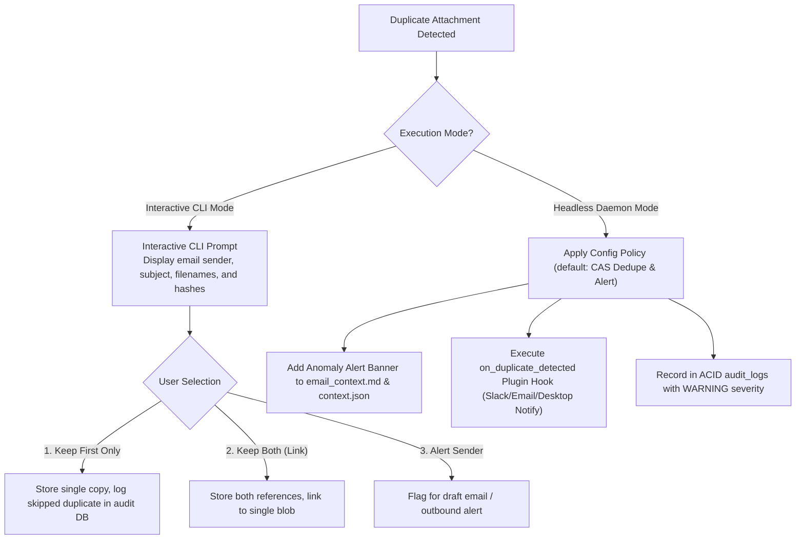
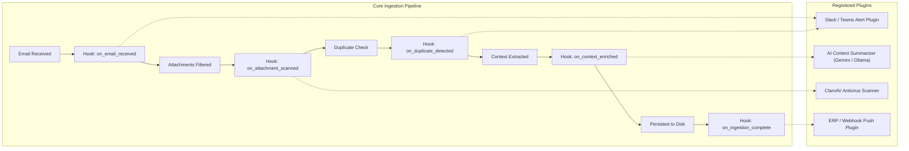

# Enterprise Email Ingestion Engine: Master Architecture & Decision Record

**Project:** Enterprise Automated Email & Attachment Ingestion Engine  
**Document Version:** 2.0 (Unified Master Specification with Plugin Architecture & Context Intelligence)  
**Date:** September 11, 2026  
**Status:** Architecture Approved — Ready for Scaffolding  

---

## 1. Executive Summary & Project Purpose

The **Enterprise Email Ingestion Engine** is a fault-tolerant, modular, and production-grade Python system designed to continuously ingest corporate emails, contextualize metadata, and extract file attachments from **Google Workspace (Gmail)** and **Microsoft 365 (Exchange Online / Outlook)**.

### Core Objectives
1. **Zero Data Loss:** Under no circumstances should an email or attachment be skipped, permanently lost, or partially corrupted due to network drops, concurrent mobile reads, or application crashes.
2. **Enterprise Authentication:** Strictly eliminate deprecated legacy protocols (Basic Auth, IMAP App Passwords) in favor of official OAuth 2.0 and Azure AD App Registration / Service Principal flows.
3. **Contextual Enrichment:** Do not save attachments in isolation. Generate human- and machine-readable sidecars (`email_context.md` and `context.json`) preserving the email body, sender intent, and conversation thread.
4. **Duplicate & Revision Intelligence:** Distinguish between exact duplicates, near-duplicate revisions (fuzzy similarity scoring), and accidental duplicate attachments, with interactive user prompts and alerts.
5. **Supervisor Mandates:**
   * **Extremely Human-Readable:** Pure Pythonic code, strict type hints (PEP 484), expressive domain naming, and zero cryptic one-liners.
   * **Strictly Modular:** Clear separation of concerns across connectors, security filters, storage, state tracking, and notifications.
   * **Plugin Architecture:** Core engine built around an extensible hook lifecycle allowing custom enterprise plugins (AI summarizers, Slack/Teams alerts, ERP webhooks, custom AV scanners).

---

## 2. Decision Matrix: Options Considered vs. Selected

| Domain | Options Evaluated | Selected Solution | Rejection Rationale & Trade-off |
| :--- | :--- | :--- | :--- |
| **Ingestion Protocol** | 1. IMAP / POP3<br>2. Polling `is:unread`<br>3. Public Webhooks<br>4. Provider APIs (Pub/Sub & Delta) | **Google Cloud Pub/Sub Streaming Pull & Microsoft Graph Delta Sync** | • **IMAP/POP3:** Deprecated by Microsoft; disabled by default in enterprise tenants.<br>• **`is:unread`:** If an employee opens the email on a smartphone, it marks as read and is silently lost forever.<br>• **Inbound Webhooks:** Require open inbound router ports / public TLS domains, impossible behind corporate NAT without unauthorized tunnels. |
| **Authentication Strategy** | 1. Basic Auth / App Passwords<br>2. Personal OAuth (Test Mode)<br>3. Official OAuth2 / Service Principals | **Official OAuth 2.0 (Production / Internal) & Azure AD Client Credentials** | • **App Passwords:** Deprecated, blocked by M365 Conditional Access policies.<br>• **Test OAuth:** Google invalidates refresh tokens after exactly 7 days (168 hours), causing the daemon to crash silently every week. |
| **Microsoft SDK** | 1. `exchangelib`<br>2. `O365/python-o365`<br>3. Official `msgraph-sdk` | **Official `msgraph-sdk` + `azure-identity`** | • **`exchangelib`:** Tied to legacy Exchange Web Services (EWS), which Microsoft is actively phasing out.<br>• **`python-o365`:** Third-party wrapper with slower adoption of Graph v1.0 features and cumbersome binary streaming support. |
| **Google SDK** | 1. Raw REST requests (`requests`)<br>2. `google-api-python-client` | **`google-api-python-client` + `google-cloud-pubsub`** | Direct raw REST requests require manually maintaining token refresh loops, backoff math, and gRPC protocol buffers for Pub/Sub. |
| **System Extensibility** | 1. Hardcoded procedural scripts<br>2. Class inheritance chains<br>3. Hook-Based Plugin Architecture | **Lifecycle Hook Plugin Engine (`BasePlugin`)** | Satisfies supervisor mandate. Allows third-party or internal developers to add custom notification, AI, or storage logic without modifying core engine files. |
| **Duplicate Handling** | 1. Blind overwrite<br>2. Silent skip<br>3. Anomaly Detection & User Notification | **Multi-Tier Anomaly Classifier with Interactive / Alert Notification** | Handles both cross-email resends and intra-email accidental twin attachments with clear user notifications. |
| **File Similarity** | 1. Binary exact match only (SHA-256)<br>2. Fuzzy Hashing (SSDEEP / TLSH) + Text Diff | **SHA-256 (Deduplication) + Fuzzy Similarity (Revision Linking)** | Exact hashing cannot identify revised drafts (e.g. a 1-character typo fix in a contract). Fuzzy hashing detects 80%+ similarity and links revisions. |
| **State & Ledger** | 1. In-memory set / text log<br>2. JSON / CSV flat file<br>3. ACID Relational Database | **SQLite (Single-Node) / PostgreSQL (Distributed) via SQLAlchemy 2.0** | Flat files and in-memory caches suffer from race conditions, corruption during abrupt process termination, and cannot enforce ACID transaction guarantees. |
| **Filetype Identification** | 1. Extension inspection (`.pdf`)<br>2. `python-magic` (`libmagic`)<br>3. `puremagic` | **`puremagic` (with `libmagic` fallback)** | • **Extension checking:** Easily spoofed (`invoice.pdf.exe`).<br>• **`python-magic`:** Requires host-level C binaries (`libmagic1`), creating cross-platform installation and Windows deployment hurdles. `puremagic` is 100% pure Python with zero binary dependencies. |
| **Signature Clutter** | 1. Download all files<br>2. MIME + CID + Size Heuristics | **Multi-Tier MIME & CID Heuristic Filter** | Unfiltered downloads flood the disk with thousands of useless 2KB social media icons (`twitter.png`, `linkedin.png`, `image001.png`). |

---

## 3. Duplicate Anomalies & User Notification System

### 3.1 Two Types of Duplicate Errors
1. **Intra-Email Duplication (Accidental Twin Attachments):**  
   * *Scenario:* A user intends to attach an invoice and a technical specification sheet, but accidentally selects and attaches `Invoice.pdf` twice to the same email.
   * *Detection:* The engine compares SHA-256 hashes of all attachments within the single message payload. If two different attachment slots share the identical hash, it triggers an `INTRA_MESSAGE_DUPLICATE_ANOMALY`.
2. **Cross-Email Duplication (Accidental Re-Send):**  
   * *Scenario:* A client sends an email with an attachment, and then 5 minutes later sends the exact same file in another email (or forwards it).
   * *Detection:* The engine queries the ACID state database by SHA-256 hash. If an exact match exists from the same sender within a recent window, it flags `RECENT_RESEND_DUPLICATE`.

### 3.2 Resolution & Notification Workflow



---

## 4. Document Intelligence: Similarity & Context Sidecars

### 4.1 Same-Name Files: Content Differences vs. Revised Drafts
When an incoming file has the same name as a previously downloaded file (e.g. `Quote_2026.pdf`):
* **Identical SHA-256:** Handled as an exact duplicate (linked, zero extra disk space).
* **Different SHA-256 + Low Similarity (< 80%):** Name collision (e.g., standard `Invoice.pdf`). Maintained in its own isolated delivery folder.
* **Different SHA-256 + High Similarity (≥ 80% via Fuzzy Hashing):** Detected as a **Revised Version**.
  * Auto-labeled with revision index: `Quote_2026 (v2).pdf`.
  * Linked to parent attachment in the database (`parent_attachment_id`).
  * Generates a visual `.diff` or change log highlighting edits.

### 4.2 The Context Sidecar Pattern
Every delivery envelope contains the raw files alongside contextual metadata:

```
Auto_download_email/
└── vendor_acme.com/
    └── 2026-09-11_12-30-00_a1b2c3/
        ├── Quote_2026_v2.pdf        <-- Downloaded document
        ├── context.json             <-- Machine-readable JSON metadata
        ├── email_context.md         <-- Human-readable Markdown preview
        └── changes_from_v1.diff     <-- Textual diff against previous version (if revision)
```

#### Sample `email_context.md`:
```markdown
# Email Context: Quote_2026_v2.pdf

> [!NOTE]
> **Document Status:** Revised Version (v2) — 94% similarity to v1 received at 10:15 AM.

- **Sender:** Sarah Connor <s.connor@acme.com>
- **Subject:** RE: Server Quote Update - Applied Discount
- **Received:** 2026-09-11T12:30:00+05:30
- **Thread ID:** 18b4a2c99f1a

### Email Body:
"Hi Jerome, as requested on the phone, I updated line item 3 to reflect the 10% volume discount. Please find the revised quote attached."

### Extracted Intent:
- **Category:** Pricing Quotation
- **Key Terms:** 10% volume discount, line item 3
```

---

## 5. Plugin Architecture & Lifecycle Hooks

To satisfy the supervisor's requirement that the system be built as an extensible, modular plugin, the core engine exposes a clean **Event Lifecycle Hook Interface**:



### 5.1 The `BasePlugin` Interface (Human-Readable Standard)
```python
from abc import ABC, abstractmethod
from typing import Optional, Dict, Any

class BasePlugin(ABC):
    """Abstract base class for all email ingestion plugins.
    
    Plugins can hook into various lifecycle stages of the ingestion process
    to inspect data, perform external validations, or send notifications.
    """
    
    @property
    @abstractmethod
    def plugin_name(self) -> str:
        """Unique identifier for the plugin."""
        pass

    def on_email_received(self, email_envelope: Dict[str, Any]) -> None:
        """Called immediately after a new email message is fetched from the provider."""
        pass

    def on_duplicate_detected(self, duplicate_event: Dict[str, Any]) -> Optional[str]:
        """Called when an intra-message or cross-message duplicate is identified.
        
        Returns an optional action override (e.g. 'SKIP', 'KEEP_BOTH', 'ALERT').
        """
        return None

    def on_context_enriched(self, context_data: Dict[str, Any]) -> Dict[str, Any]:
        """Called during sidecar generation to allow AI or custom summarizers
        to append additional contextual tags or analysis.
        """
        return context_data

    def on_ingestion_complete(self, record: Dict[str, Any]) -> None:
        """Called after an attachment and its sidecar are committed to storage."""
        pass
```

---

## 6. Project Directory & Modularity Structure

The codebase is structured to ensure that every module has a single, crystal-clear responsibility:

```
email_ingestion_engine/
├── pyproject.toml                     # Modern build and dependency specifications
├── config.yaml                        # User-editable configuration file
├── README.md                          # Comprehensive setup and architectural guide
│
├── src/email_ingestion/
│   ├── __init__.py
│   ├── main.py                        # CLI entry point (start daemon, sync-now, inspect)
│   ├── config.py                      # Pydantic Settings with strict validation
│   │
│   ├── connectors/                    # Provider ingestion clients
│   │   ├── __init__.py
│   │   ├── base.py                    # BaseEmailConnector abstract class
│   │   ├── gmail_connector.py         # Google Workspace & Pub/Sub client
│   │   ├── ms_graph_connector.py      # Microsoft Graph & Delta Sync client
│   │   └── mock_connector.py          # Offline test connector for instant validation
│   │
│   ├── security/                      # Threat prevention & sanitization
│   │   ├── __init__.py
│   │   ├── signature_filter.py        # MIME inline & HTML CID signature drop
│   │   ├── magic_verifier.py          # puremagic true header & PE executable sniffing
│   │   ├── path_sanitizer.py          # Filename normalization & traversal defense
│   │   └── archive_guard.py           # Zip-bomb decompression ratio check
│   │
│   ├── intelligence/                  # Context & Similarity Engine
│   │   ├── __init__.py
│   │   ├── context_sidecar.py         # Generates email_context.md and context.json
│   │   ├── fuzzy_similarity.py        # SSDEEP / Levenshtein revision detection
│   │   └── duplicate_detector.py      # Intra- & Cross-email duplicate anomaly detector
│   │
│   ├── storage/                       # Atomic disk & file persistence
│   │   ├── __init__.py
│   │   ├── atomic_writer.py           # Two-phase .tmp -> SHA-256 verify -> os.replace
│   │   └── layout_manager.py          # Auto_download_email folder hierarchy
│   │
│   ├── database/                      # ACID state & deduplication ledger
│   │   ├── __init__.py
│   │   ├── models.py                  # SQLAlchemy ORM models (Account, Message, Attachment)
│   │   └── session.py                 # Thread-safe SQLite / Postgres session manager
│   │
│   └── plugins/                       # Extensible Plugin Framework
│       ├── __init__.py
│       ├── base_plugin.py             # BasePlugin abstract lifecycle interface
│       ├── manager.py                 # Plugin loader & lifecycle hook dispatcher
│       └── builtin/
│           ├── desktop_notifier.py    # Desktop / CLI duplicate alert plugin
│           └── ai_summarizer.py       # Optional LLM context enrichment plugin
│
└── tests/                             # Comprehensive automated test suite
    ├── test_connectors.py
    ├── test_security_filters.py
    ├── test_duplicate_anomalies.py
    ├── test_context_sidecar.py
    └── test_plugins.py
```

---

## 7. Selected Tech Stack

| Component | Library / Technology | Purpose |
| :--- | :--- | :--- |
| **Language** | Python `>= 3.11` | Core execution environment |
| **Microsoft Client** | `msgraph-sdk` & `azure-identity` | Official Microsoft 365 Graph client and Azure authentication |
| **Google Client** | `google-api-python-client` & `google-cloud-pubsub` | Official Gmail client and firewall-friendly persistent gRPC streaming pull |
| **Type & Config Validation** | `pydantic` & `pydantic-settings` | Strict environment variable and `config.yaml` schema enforcement |
| **File Sniffing** | `puremagic` | Pure-Python header and magic byte validation with zero C-dependencies |
| **Resilience & Retries** | `tenacity` | Jittered exponential backoff and rate-limit backoff |
| **Database & ORM** | `SQLAlchemy 2.0` & `aiosqlite` | ACID transaction handling for SQLite and PostgreSQL |
| **Plugin Core** | Built-in `BasePlugin` Hook Architecture | Simple, human-readable lifecycle dispatcher without heavy external frameworks |
| **Similarity Analysis** | Standard `difflib` + optional `ssdeep` / `tlsh` | Detecting revised drafts and computing document delta scores |
