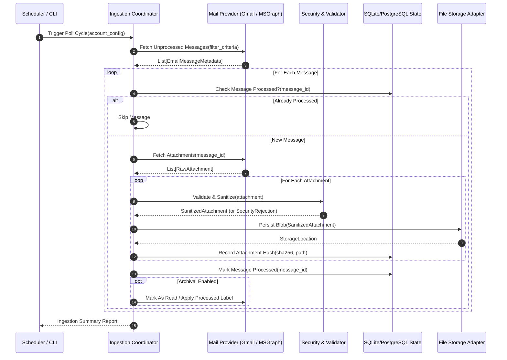
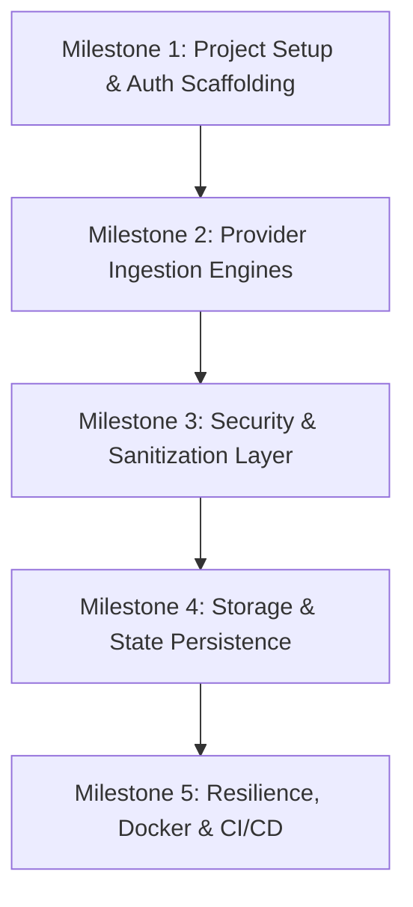

# Enterprise Email Ingestion & Attachment Automation System
## Production-Grade Architecture, Security & Technical Specification Report

---

## 1. Executive Summary & Objective

This document outlines the production architecture and security blueprint for an **Enterprise Email Ingestion and Attachment Automation Engine** built natively in Python. 

The system operates across both **Google Workspace (Gmail)** and **Microsoft 365 (Outlook / Exchange Online)**. It systematically queries, filters, downloads, validates, and archives email attachments to secure on-premises or cloud targets.

### Core Architectural Principles
* **Official First-Party SDKs Only:** Exclusively utilize official client libraries maintained directly by Google (`google-api-python-client`, `google-auth`) and Microsoft (`msgraph-sdk`, `azure-identity`).
* **Zero-Trust & Least-Privilege Identity:** Strict adherence to modern OAuth 2.0 authorization flows, RBAC, short-lived bearer tokens, and application access restrictions (Exchange Application Access Policies and GCP Service Account scoping).
* **Deterministic Idempotency:** Full duplicate-detection pipeline using cryptographically computed message identifiers and SHA-256 payload checksums stored in a dedicated state database.
* **Defensive Attachment Processing:** Path-traversal mitigation, MIME-type magic byte verification, payload size guardrails, and sandboxed storage writes.
* **Resilience & Enterprise Observability:** Tenacity-backed exponential backoff for rate limiting (HTTP 429) and structured JSON audit logging conforming to OpenTelemetry standards.

---

## 2. Official Authentication & Identity Architecture

Legacy protocols (Basic Authentication, Plain IMAP4, POP3) are prohibited. All interactions use **OAuth 2.0** with strict scoping.

```mermaid
flowchart TD
    subgraph GoogleCloud["Google Cloud Platform (GCP)"]
        GCP_Admin["GCP Admin / Consent"] --> GCP_Creds["OAuth2 Client ID / Service Account"]
        GCP_Creds --> GCP_Auth["google-auth / google-auth-oauthlib"]
        GCP_Auth --> Gmail_API["Gmail REST API v1"]
    end

    subgraph MicrosoftEntra["Microsoft Entra ID (Azure AD)"]
        Azure_Admin["M365 Global Admin"] --> Azure_App["App Registration + App Access Policy"]
        Azure_App --> Azure_Auth["azure-identity (ClientSecretCredential)"]
        Azure_Auth --> MSGraph_API["Microsoft Graph API v1.0"]
    end

    subgraph IngestionCore["Python Ingestion Core"]
        GCP_Auth -.->|Bearer Token| IngestionCore
        Azure_Auth -.->|Bearer Token| IngestionCore
    end
```

### 2.1. Gmail / Google Workspace Integration

#### Official SDK Packages
* `google-api-python-client`: Official Google discovery client.
* `google-auth` & `google-auth-httplib2`: Enterprise authentication and token management.
* `google-auth-oauthlib`: User consent and authorization code flow.

#### Recommended Authentication Models
1. **Unattended Daemon / Multi-Mailbox (Enterprise Recommended):**
   * **Mechanism:** GCP Service Account with **Domain-Wide Delegation (DWD)**.
   * **Setup:** Created in Google Cloud Console, authorized in Google Workspace Admin Console (`Security > Access and data control > API controls`).
   * **Subject Impersonation:** The service account impersonates target mailbox addresses (e.g., `invoices@company.com`) without storing user passwords.
2. **Single Mailbox / Interactive Deployment:**
   * **Mechanism:** Standard OAuth 2.0 Authorization Code Flow with PKCE.
   * **Tokens:** Short-lived access token (60-minute expiry) with auto-refreshing via securely stored Refresh Tokens.

#### Minimal Scope Matrix (Least Privilege)
| Mode | Required Scope | Justification |
| :--- | :--- | :--- |
| **Read-Only Ingestion** | `https://www.googleapis.com/auth/gmail.readonly` | Read email metadata and fetch raw attachment blobs without write permissions. |
| **Stateful Archival** | `https://www.googleapis.com/auth/gmail.modify` | Add labels (e.g., `ATTACHMENT_INGESTED`) or mark messages as read post-processing. |

---

### 2.2. Outlook / Microsoft 365 Integration

#### Official SDK Packages
* `msgraph-sdk`: Official Microsoft Graph Python SDK.
* `azure-identity`: Official Azure Active Directory / Entra ID token provider.

#### Recommended Authentication Models
1. **Unattended Daemon Service (Enterprise Recommended):**
   * **Mechanism:** OAuth 2.0 **Client Credentials Grant** (`azure.identity.ClientSecretCredential` or `CertificateCredential`).
   * **Entra ID App Registration:** Registered in tenant with Application Permissions.
   * **Mailbox Scoping Guardrail:** By default, `Mail.Read` application permissions grant access to *all* tenant mailboxes. To enforce least privilege, an **Exchange Online Application Access Policy** (`New-ApplicationAccessPolicy`) must be applied via PowerShell to limit the application's access strictly to designated shared/service mailboxes.
2. **Interactive Delegated Access:**
   * **Mechanism:** Authorization Code Flow with PKCE using `azure.identity.InteractiveBrowserCredential` or `DeviceCodeCredential`.

#### Minimal Scope Matrix (Least Privilege)
| Mode | Permission Name | Type | Justification |
| :--- | :--- | :--- | :--- |
| **Read-Only Ingestion** | `Mail.Read` | Application / Delegated | Fetch messages, attachments, and headers. |
| **Stateful Archival** | `Mail.ReadWrite` | Application / Delegated | Move messages to archive folders or update read flags. |

---

### 2.3. Secret & Token Management
* **Never store raw secrets in source code or local text files.**
* Use enterprise secret providers in production:
  * Cloud: **Azure Key Vault**, **AWS Secrets Manager**, or **GCP Secret Manager**.
  * On-Premises / Hybrid: **HashiCorp Vault** or Kubernetes Secrets injected as environment variables.
* Tokens in memory are kept only in protected credential instances; expired tokens are rotated automatically by `azure-identity` and `google-auth`.

---

## 3. Modular System Architecture

The application adopts a **Hexagonal / Clean Architecture** pattern to isolate mail protocols, business logic, sanitization, and storage.



### 3.1. Layered Component Breakdown

1. **Configuration Layer (`app.config`)**:
   * Backed by `pydantic-settings` to validate environment variables, secret bindings, filtering regex, and storage paths.
2. **Provider Abstraction (`app.providers.base`)**:
   * `BaseMailProvider`: Abstract base class defining uniform methods (`connect()`, `search_messages()`, `download_attachment()`, `mark_processed()`).
   * `GmailProvider`: Implementation wrapping `googleapiclient.discovery.build("gmail", "v1", ...)`.
   * `OutlookProvider`: Implementation wrapping `msgraph.GraphServiceClient`.
3. **Security & Sanitization Engine (`app.security`)**:
   * Sanitizes filenames (stripping dangerous paths, control chars, and non-printable bytes).
   * Computes SHA-256 payload checksums.
   * Performs file-signature magic byte inspection (preventing `.exe` renamed as `.pdf`).
4. **Idempotency & Audit Store (`app.storage.state`)**:
   * Lightweight database (SQLite for single-node / PostgreSQL for distributed cluster).
   * Records processing history to ensure zero duplicate downloads across restarts.
5. **Storage Destination Adapters (`app.storage.destinations`)**:
   * Pluggable sinks: Local filesystem / POSIX volume, AWS S3 / MinIO, or Azure Blob Storage.

---

## 4. Attachment Security & Defensive Engineering

Enterprise systems receiving external email attachments face significant threat vectors. The following defensive pipeline runs on every attachment before persistence:

```mermaid
flowchart LR
    RawBlob["Raw Incoming Stream"] --> PathSanitize["Path Traversal Strip (secure_filename)"]
    PathSanitize --> ExtFilter["Extension Allowlist (.pdf, .xlsx, .csv, etc.)"]
    ExtFilter --> MagicCheck["Magic Byte MIME Verification (libmagic)"]
    MagicCheck --> SizeGuard["Size Quota Check (< 25MB)"]
    SizeGuard --> HashCompute["SHA-256 Checksum Calculation"]
    HashCompute --> SafeWrite["Safe Atomic Storage Write"]
```



### 4.1. Security Defenses Matrix

| Risk Vector | Attack Scenario | Enterprise Countermeasure |
| :--- | :--- | :--- |
| **Path Traversal** | Attachment named `../../../../etc/shadow` or `..\Windows\System32\malware.dll` | Filename sanitization extracting only the basename, removing `..`, and applying a deterministic UUID prefix or hash suffix. |
| **Extension Spoofing** | Executable renamed to `invoice_2026.pdf` | Inspect the first 2048 magic bytes using `python-magic` to confirm true MIME matches declared header. |
| **Zip Bomb / Decompression** | 42KB compressed file extracting to 500GB | Restrict archive unpacking or run unzipping with strict per-file size and count limits. |
| **Collision Overwrite** | Two distinct senders submit `receipt.pdf` | Store files using partitioned hierarchy: `<storage_root>/<date>/<message_id>/<sanitized_filename>`. |
| **Malware Injection** | Infected PDF payload | Extensible post-save hook supporting ClamAV socket scanning or corporate ICAP / VirusTotal API. |

---

## 5. Database Schema for Idempotency & Audit

To guarantee deterministic processing and enable compliance audits, the system maintains two relational tables:

```sql
-- Tracks every scanned email message
CREATE TABLE IF NOT EXISTS processed_messages (
    id INTEGER PRIMARY KEY AUTOINCREMENT,
    provider VARCHAR(32) NOT NULL,            -- 'gmail' | 'outlook'
    account_mailbox VARCHAR(255) NOT NULL,    -- target inbox
    message_id VARCHAR(255) NOT NULL UNIQUE,  -- API Message ID
    internet_message_id VARCHAR(255),         -- RFC 822 Message-ID
    sender VARCHAR(255) NOT NULL,
    subject TEXT,
    received_at TIMESTAMP NOT NULL,
    processed_at TIMESTAMP DEFAULT CURRENT_TIMESTAMP,
    attachment_count INTEGER DEFAULT 0,
    status VARCHAR(32) NOT NULL               -- 'SUCCESS' | 'FAILED' | 'SKIPPED'
);

-- Tracks every extracted attachment
CREATE TABLE IF NOT EXISTS processed_attachments (
    id INTEGER PRIMARY KEY AUTOINCREMENT,
    message_id VARCHAR(255) NOT NULL,
    attachment_id VARCHAR(255) NOT NULL,
    original_filename VARCHAR(255) NOT NULL,
    sanitized_filename VARCHAR(255) NOT NULL,
    sha256_hash CHAR(64) NOT NULL,
    file_size_bytes BIGINT NOT NULL,
    mime_type VARCHAR(128) NOT NULL,
    storage_path TEXT NOT NULL,
    created_at TIMESTAMP DEFAULT CURRENT_TIMESTAMP,
    FOREIGN KEY (message_id) REFERENCES processed_messages(message_id)
);

CREATE INDEX idx_messages_id ON processed_messages(message_id);
CREATE INDEX idx_attachments_hash ON processed_attachments(sha256_hash);
```

---

## 6. Enterprise Project Directory Structure

A clean, modular layout following current Python packaging standards (`pyproject.toml`):

```text
email-attachment-automation/
├── .github/
│   └── workflows/
│       └── ci.yml               # Automated linting, typing & unit tests
├── docker/
│   ├── Dockerfile               # Non-root, hardened multi-stage image
│   └── docker-compose.yml       # Local integration testing environment
├── src/
│   └── mail_ingestion/
│       ├── __init__.py
│       ├── __main__.py          # Entrypoint: python -m mail_ingestion
│       ├── config/
│       │   ├── __init__.py
│       │   └── settings.py      # Pydantic Settings & Env validation
│       ├── providers/
│       │   ├── __init__.py
│       │   ├── base.py          # Abstract Base Mail Provider
│       │   ├── gmail.py         # Google API Client implementation
│       │   └── outlook.py       # MS Graph SDK implementation
│       ├── security/
│       │   ├── __init__.py
│       │   ├── sanitizer.py     # Filename & path validation
│       │   └── validator.py     # Magic bytes, hash & size verification
│       ├── storage/
│       │   ├── __init__.py
│       │   ├── state_db.py      # SQLite / PostgreSQL Idempotency tracker
│       │   └── filestore.py     # Safe atomic disk & cloud writers
│       ├── core/
│       │   ├── __init__.py
│       │   └── engine.py        # Coordinator workflow engine
│       └── utils/
│           ├── __init__.py
│           └── logging.py       # Structured JSON logger
├── tests/
│   ├── conftest.py              # Pytest fixtures & mocks
│   ├── test_security.py         # Sanitizer & magic-byte tests
│   ├── test_gmail_provider.py   # Mocked Gmail API tests
│   └── test_outlook_provider.py # Mocked MS Graph tests
├── pyproject.toml               # Poetry / Flit project configuration
├── README.md                    # Setup, auth & deployment documentation
└── credentials/                 # Local development gitignored secrets
    └── .gitignore
```

---

## 7. Recommended Tech Stack & Dependencies

```toml
[project]
name = "mail-attachment-ingestion"
version = "1.0.0"
requires-python = ">=3.11"
dependencies = [
    # Official Google Workspace SDKs
    "google-api-python-client>=2.140.0",
    "google-auth>=2.34.0",
    "google-auth-oauthlib>=1.2.1",
    "google-auth-httplib2>=0.2.0",

    # Official Microsoft 365 SDKs
    "msgraph-sdk>=1.8.0",
    "azure-identity>=1.17.0",

    # Configuration, Validation & Data Models
    "pydantic>=2.8.0",
    "pydantic-settings>=2.4.0",

    # Security & File Integrity
    "python-magic>=0.4.27",      # True MIME validation
    "cryptography>=43.0.0",

    # Reliability & Resilience
    "tenacity>=9.0.0",           # Exponential backoff & retry
    "structlog>=24.4.0",         # Structured enterprise logging
    "sqlalchemy>=2.0.32",        # Cross-database ORM & state tracking
]

[project.optional-dependencies]
dev = [
    "pytest>=8.3.0",
    "pytest-cov>=5.0.0",
    "pytest-mock>=3.14.0",
    "ruff>=0.6.0",               # High-speed linter & formatter
    "mypy>=1.11.0",              # Static type analysis
]
```

---

## 8. Implementation Roadmap



1. **Milestone 1: Project Setup & Authentication Scaffolding**
   * Initialize `pyproject.toml`, Git repository, and strict Ruff/MyPy configurations.
   * Implement GCP OAuth/Service Account factory and Azure Entra ID credential resolver.
2. **Milestone 2: Provider Ingestion Engines**
   * Implement `BaseMailProvider` interface.
   * Build `GmailProvider` (search queries, message parsing, attachment downloading).
   * Build `OutlookProvider` using `msgraph-sdk`.
3. **Milestone 3: Security, Sanitization & Validation Layer**
   * Implement strict path sanitization and extension allowlisting.
   * Implement MIME inspection with fallback heuristics.
   * Add SHA-256 calculation for deduplication.
4. **Milestone 4: Storage & Idempotency Store**
   * Build SQLite/PostgreSQL state tracking repository.
   * Build disk storage manager with date-partitioned safe writing.
5. **Milestone 5: Production Readiness & Hardening**
   * Tenacity retry decorators for API rate-limit resilience (HTTP 429).
   * Dockerfile multi-stage build (distroless/non-root execution).
   * Complete test suite with 90%+ branch coverage.
