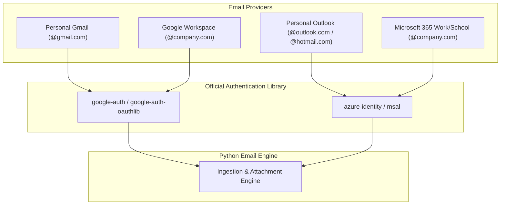
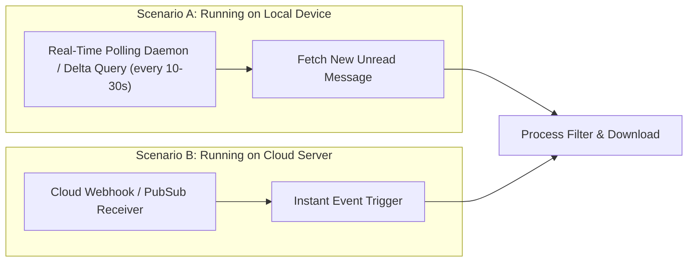

# Enterprise Email Attachment Auto-Ingestion System
## System Specification & Architectural Blueprint

---

## 1. Plain-Language Explanations of Key Concepts

### 1.1 What is "Credential & Secret Storage"?
When an application connects to Google or Microsoft on your behalf, it requires credentials:
* **Client ID & Client Secret:** Equivalent to an application's username and password issued by Google Cloud or Microsoft Entra ID.
* **Access Tokens & Refresh Tokens:** Digital security passes given to the app once authorized. The access token lasts about 60 minutes, while the refresh token is used automatically to get a fresh pass without asking the user to log in again.

**How they must be stored:**
* **Never in Code:** Secrets must never be written directly inside `.py` source code files or committed to Git.
* **On a User's Local Machine:** Stored inside a secure environment file (e.g., `.env` file kept on the machine with restricted file permissions) or encrypted via the operating system's native keychain (Windows Credential Manager, macOS Keychain, Linux Secret Service).
* **On a Server / Cloud:** Injected as secure environment variables or retrieved from a managed vault (AWS Secrets Manager, Azure Key Vault, Google Secret Manager).

---

### 1.2 What is "Sanitization"?
When someone sends an email with an attachment, the sender controls the attachment's filename. That filename might contain:
* Characters not allowed by your operating system (e.g., `/`, `\`, `:`, `*`, `?`, `"`, `<`, `>`, `|`).
* Malicious tricks like "path traversal" (e.g., a file named `../../../../etc/passwd` or `../../Windows/system32/cmd.exe` designed to escape its folder and overwrite important system files).
* Unicode control characters or invisible whitespace that causes filesystem errors.

**"Sanitization"** simply means cleaning the filename before saving it:
1. Stripping out any relative path indicators (`../` or `..\`).
2. Replacing illegal characters with clean underscores (`_`).
3. Ensuring the file safely lands **inside** your intended folder.

---

### 1.3 What is "A Containerized Service"?
* A **container** (typically built using Docker) packages your entire application—the Python code, the exact Python version, and all required official libraries—into a lightweight, standalone bundle.
* **Why it matters:** It eliminates the classic problem of *"it works on my computer but fails on the server."* A containerized service can be started with a single command on Windows, Mac, Linux, or in the cloud (AWS, Azure, Google Cloud) without needing to manually install dependencies.

---

## 2. Directory Structure & File Hierarchy

The user has defined a strict folder hierarchy for all downloaded files:

```
Auto_download_email/
├── person1@example.com/
│   ├── 2026-09-10_21-45-00/
│   │   ├── invoice_9812.pdf
│   │   └── data_summary.xlsx
│   └── 2026-09-10_22-10-30/
│       └── receipt.png
├── person2@company.org/
│   └── 2026-09-10_21-50-12/
│       └── quarterly_report.docx
└── person3@domain.com/
    └── 2026-09-10_22-00-00/
        └── specification.pdf
```

### Path Construction Rules:
* **Root Directory:** `Auto_download_email` (configurable to local disk path or cloud storage bucket prefix).
* **Sender Subfolder:** Sanitized sender name or sender email address (e.g., `person1@example.com` or `John Doe`).
* **Timestamp Subfolder:** Standardized timestamp formatted as `YYYY-MM-DD_HH-MM-SS` corresponding to the email's `Date` header.
* **Attachment Files:** Original sanitized attachment filenames placed directly in the timestamp subfolder.

---

## 3. Account Compatibility: Personal vs. Organization Mail

The system supports both personal and organization mailboxes using **official SDKs only**:



### 3.1 Google (Gmail & Google Workspace)
* **Official SDK:** `google-api-python-client`, `google-auth`, `google-auth-oauthlib`.
* **Personal Accounts (`@gmail.com`):** Standard OAuth 2.0 Authorization Code Flow. The user signs in once via a browser consent screen; the app stores a refresh token locally to maintain unattended operation.
* **Workspace / Organization Accounts:** Supports both user OAuth and GCP Service Accounts with Domain-Wide Delegation (DWD).

### 3.2 Microsoft (Outlook.com & Microsoft 365)
* **Official SDK:** `msgraph-sdk`, `azure-identity`.
* **Personal Accounts (`@outlook.com`, `@hotmail.com`, `@live.com`):** Registered under Microsoft Entra ID with personal Microsoft account support (`common` or `consumers` endpoint) using interactive browser or device code flow.
* **Organization Accounts (M365 / Exchange Online):** Client Credentials Grant (daemon mode for shared mailboxes) or Delegated User Flow.

---

## 4. Real-Time Event-Driven Ingestion

The user requested real-time automatic downloads as soon as an email arrives. There are two deployment scenarios:



| Deployment Mode | Mechanism | How it Works | Best Used When |
| :--- | :--- | :--- | :--- |
| **Local Device / Desktop** | **Near Real-Time Stream / Short Polling** | The daemon queries for new unread messages from trusted senders every 10–30 seconds, or keeps an active lightweight connection. Requires **no public IP or external domain**. | Running on a laptop, office desktop, or local office server. |
| **Cloud Service** | **Push Webhooks & Cloud Pub/Sub** | Google Pub/Sub sends a push notification to an HTTPS endpoint; Microsoft Graph sends a webhook notification upon message arrival. | Running in Docker on AWS, GCP, Azure, or DigitalOcean with a public domain/IP. |

---

## 5. Storage Destinations: Device vs. Cloud

The user can choose where files are downloaded via a simple configuration switch:

```yaml
storage:
  destination: "local" # Options: "local", "aws_s3", "google_cloud_storage", "azure_blob"
  
  local:
    base_path: "./Auto_download_email"

  aws_s3:
    bucket_name: "company-email-attachments"
    prefix: "Auto_download_email"

  google_cloud_storage:
    bucket_name: "company-email-attachments"
    prefix: "Auto_download_email"

  azure_blob:
    container_name: "email-attachments"
    prefix: "Auto_download_email"
```

A clean **StorageAdapter** interface allows switching storage backends with zero code changes to the email-processing logic.

---

## 6. Safe & Pragmatic Error Handling (Non-Disruptive)

Since the system downloads files strictly from **trusted client-approved senders**, heavy-handed antivirus layers that produce false positives and interrupt workflows are avoided. Instead, enterprise reliability practices are applied:

1. **Deterministic Deduplication (Audit State Log):**
   * A local SQLite database or JSON log records:
     * `message_id`: Unique email identifier.
     * `sender`: Email address.
     * `received_timestamp`: Email timestamp.
     * `attachment_name`: Name of attachment.
     * `sha256_checksum`: Cryptographic fingerprint of file content.
   * If an email is re-scanned, the system detects it has already been processed and skips downloading.
2. **Mark as Read & Flagging:**
   * Immediately upon successful attachment download, the email is officially marked as **Read** (`UNREAD` label removed in Gmail; `isRead = True` in Outlook) so subsequent passes ignore it.
3. **Transient Network Retry (Exponential Backoff):**
   * If a network blip or temporary rate limit (HTTP 429) occurs, the engine retries gracefully using exponential backoff (e.g., retry after 2s, 4s, 8s) rather than crashing.
4. **File Integrity Verification:**
   * Validates that downloaded attachments are non-empty (>0 bytes) and fully received before committing the state record.

---

## 7. Client Filter Configuration

The client decides exactly which emails to process through an intuitive configuration file (`config.yaml`):

```yaml
filters:
  # Filter only emails from these trusted senders (exact email or entire domain)
  trusted_senders:
    - "client@partnercompany.com"
    - "invoices@vendor.com"
    - "*@trustedclient.com"
  
  # Only process emails containing attachments
  require_attachments: true

  # Optional file extension filter (leave empty to download all attachments)
  allowed_extensions:
    - ".pdf"
    - ".xlsx"
    - ".csv"
    - ".docx"
    - ".zip"
```

---

## 8. Proposed Project Source Tree

```
email_attachment_downloader/
├── README.md                          # Comprehensive setup & user manual
├── requirements.txt                   # Official libraries only
├── config.yaml                        # User configuration (senders, storage, settings)
├── .env.example                       # Template for client IDs, secrets, tokens
├── Dockerfile                         # Container definition for server deployment
├── docker-compose.yml                 # Easy one-command runner
├── src/
│   ├── __init__.py
│   ├── main.py                        # Entry point (CLI runner / daemon)
│   ├── config.py                      # Configuration loader & validator
│   ├── auth/
│   │   ├── __init__.py
│   │   ├── gmail_auth.py              # Official Google OAuth / Service Account auth
│   │   └── outlook_auth.py            # Official Microsoft Graph / Entra ID auth
│   ├── connectors/
│   │   ├── __init__.py
│   │   ├── base_connector.py          # Unified email interface
│   │   ├── gmail_connector.py         # Gmail REST API v1 operations
│   │   └── outlook_connector.py       # MS Graph API v1.0 operations
│   ├── storage/
│   │   ├── __init__.py
│   │   ├── base_storage.py            # Storage adapter interface
│   │   ├── local_storage.py           # Auto_download_email local filesystem writer
│   │   └── cloud_storage.py           # S3 / GCS / Azure Blob writer
│   └── utils/
│       ├── __init__.py
│       ├── sanitizer.py               # Filename and path traversal sanitizer
│       ├── state_tracker.py           # SQLite/Log deduplication & audit ledger
│       └── logger.py                  # Structured console & file logging
└── tests/
    ├── test_sanitizer.py
    └── test_state_tracker.py
```
